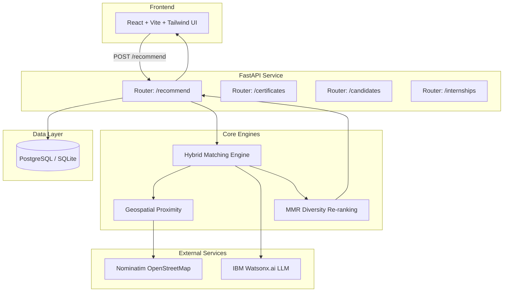

# Architecture

## System Architecture

The platform follows a decoupled client-server architecture, using a hybrid AI matching engine at its core.

## Components

| Component | Technology | Responsibility |
|---|---|---|
| Frontend | React, Vite, Tailwind CSS | Progressive Web App (PWA) providing an accessible, icon-driven, voice-enabled UI for candidates and employers. |
| Backend API | FastAPI (Python) | High-performance routing, matching logic execution, and database orchestration. |
| NLP & Matching Engine | scikit-learn, RapidFuzz | Performs TF-IDF semantic similarity and fuzzy matching between candidate skills and job requirements. |
| Geocoding | Geopy, Nominatim | Calculates exact Haversine distance between candidates and internships. |
| Explainable AI | IBM Watsonx.ai | Uses the `ibm/granite-13b-instruct-v2` model to generate human-readable explanations of *why* an internship matches. |
| Database | PostgreSQL (Supabase) / SQLite | Stores candidates, internships, and verified certificates. |

## Data Flow

1. **Profile Submission**: A candidate submits their profile details, including skills, location, and verified certificates via the React frontend.
2. **Matching Engine Triggered**: The backend fetches active internships from the database and runs the `score_single` evaluation loop.
3. **Scoring**: Each internship is scored using TF-IDF and fuzzy logic for skills, Haversine formula for proximity, and education constraints.
4. **LLM Explanation**: The candidate's skills and the top matched internship requirements are sent to Watsonx.ai via a REST call with a strict 3-second timeout to get a natural language explanation.
5. **Diversity Re-Ranking**: The top results undergo Maximal Marginal Relevance (MMR) re-ranking to ensure a diverse set of opportunities.
6. **Delivery**: The final JSON payload, including scores and text explanations, is sent back to the frontend.

## Security Considerations

- API keys (like `WATSONX_API_KEY`) are stored in `.env` variables and are never committed to the repository.
- A lightweight header-based stub (`x-company-id`) handles initial employer authorization (to be replaced with OAuth in production).
- Database operations are executed using secure parameterized queries via SQLAlchemy/ORM to prevent SQL injection.

## Scalability Notes

The FastAPI backend is entirely stateless and can be horizontally scaled behind a load balancer. The TF-IDF vectorization can be computationally expensive, so the active internship dataset is fetched once per request and scored entirely in-memory. Geocoding results from Nominatim are heavily cached to prevent rate-limiting. IBM Watsonx.ai calls are decoupled using a strict timeout to ensure the app never hangs if the LLM is slow.
